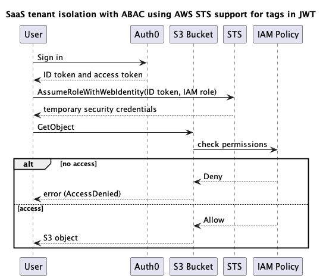

# SaaS tenant isolation with ABAC using AWS STS support for tags in JWT

As independent software vendors (ISVs) shift toward SaaS, they adopt a shared 
infrastructure model to achieve cost and operational efficiency. They also have to 
determine how to implement tenant isolation. Enforcing tenant boundary is imperative 
for SaaS businesses and is one of the foundational topics for SaaS providers. As SaaS
offering grows, it composes multiple applications. Hence, when building applications, 
a solution should consider organizational aspects besides technology.

Applications can use [attribute-based access control (ABAC)](https://docs.aws.amazon.com/IAM/latest/UserGuide/introduction_attribute-based-access-control.html) 
authorization strategy with AWS Identity and Access Management (AWS IAM) to implement 
tenant isolation. [How to implement SaaS tenant isolation with ABAC and AWS IAM](https://aws.amazon.com/blogs/security/how-to-implement-saas-tenant-isolation-with-abac-and-aws-iam/) 
blog post describes the implementation of this approach using a library that calls
AWS Security Token Service (AWS STS) [AssumeRole](https://docs.aws.amazon.com/IAM/latest/UserGuide/id_session-tags.html#id_session-tags_adding-assume-role) API. 

Using a library involves the following steps:
1. Application passes a JSON Web Token (JWT) for the signed-in user to the library
2. Library verifies the JWT
3. Library extracts tenant ID from JWT claims and maps to session tag
4. Library calls AWS STS `AssumeRole` API to assume the application-provided IAM role
5. Application uses the scoped temporary security credentials to access resources

The library approach involves the following considerations:
* Each application should install the library
* Each application executes sensitive custom code that controls tenant isolation
* Development for each programming language a company uses
* Upgrade campaigns for each application

In this walkthrough, we describe an alternative approach that doesn't involve the above
considerations. The approach implements ABAC authorization strategy using AWS STS 
[AssumeRoleWithWebIdentity](https://docs.aws.amazon.com/IAM/latest/UserGuide/id_session-tags.html#id_session-tags_adding-assume-role-idp) API. 

Using the AWS STS `AssumeRoleWithWebIdentity` API involves the following steps:
1. Application calls AWS STS `AssumeRoleWithWebIdentity` API with the JWT for the 
   signed-in user
2. Application uses the scoped temporary security credentials to access resources

The AWS STS `AssumeRoleWithWebIdentity` API approach simplifies the tenant isolation 
story because it allows to:
* Delegate JWT verification and tenant ID to session tag mapping to the 
  `AssumeRoleWithWebIdentity` API
* Use readily available AWS SDKs for multiple programming languages
* Remove the need for library upgrade campaigns

**Note:** AWS STS [requires](https://docs.aws.amazon.com/IAM/latest/UserGuide/id_session-tags.html#id_session-tags_adding-assume-role-idp) tags claim value to be a JSON object. Amazon Cognito 
currently supports JSON strings as claim value through [pre token generation Lambda 
trigger](https://docs.aws.amazon.com/cognito/latest/developerguide/user-pool-lambda-pre-token-generation.html#cognito-user-pools-lambda-trigger-syntax-pre-token-generation). We will be using Auth0 that does support JSON objects.

## Architecture diagram
<p>
  
</p>

## Sequence diagram


## Create development environment

See [Getting Started With the AWS CDK](https://docs.aws.amazon.com/cdk/latest/guide/getting_started.html)
for additional details and prerequisites

### Clone the code

```bash
git clone https://github.com/aws-samples/aws-saas-factory-samples
cd aws-saas-factory-samples/saas-tenant-isolation-abac-jwt-sts
```

### Create Python virtual environment and install the dependencies

```bash
python3.9 -m venv .venv
source .venv/bin/activate

# [Optional] Use pip-tools to upgrade dependencies
# Pinning pip-tools to 6.4.0 and pip to 21.3.1 due to
# https://github.com/jazzband/pip-tools/issues/1576
pip install pip-tools==6.4.0
pip install pip==21.3.1

./scripts/install-deps.sh
./scripts/run-tests.sh
```

### [Optional] Upgrade AWS CDK Toolkit version

```bash
vi package.json  # Update the "aws-cdk" package version

./scripts/install-deps.sh
./scripts/run-tests.sh
```

### [Optional] Upgrade dependencies (ordered by constraints)

Consider [AWS CDK Toolkit (CLI)](https://docs.aws.amazon.com/cdk/latest/guide/reference.html#versioning) compatibility 
when upgrading AWS CDK packages version.

```bash
pip-compile --upgrade requirements.in
pip-compile --upgrade requirements-dev.in

./scripts/install-deps.sh
./scripts/run-tests.sh
```

## Test the application

### Configure Auth0 domain

[Sign up](https://auth0.com/signup) with or [sign in](https://auth0.com/api/auth/login?redirectTo=dashboard) to Auth0. Find your [Auth0 tenant name](https://auth0.com/docs/get-started/tenant-settings/find-your-tenant-name-or-tenant-id).

```bash
# E.g., dev-zrlq0yr7
_auth0_tenant="YOUR_TENANT"
# E.g., us
_auth0_region="YOUR_REGION"
# E.g., dev-zrlq0yr7.us.auth0.com
_auth0_domain="${_auth0_tenant}.${_auth0_region}.auth0.com"
```
```bash
sed -i "" -e "s/DOMAIN_PLACEHOLDER/${_auth0_domain}/" constants.py
```

### Create Auth0 application client
**Note:** Application name is not a unique identifier, hence the script will create 
a new application with the same name on each execution.

Get Management API [access token](https://auth0.com/docs/secure/tokens/access-tokens/get-management-api-access-tokens-for-testing) 
for testing.

```bash
_auth0_mgmt_api_token="YOUR_API_TOKEN"
```
```bash
_client_id=$(env AUTH0_MGMT_API_TOKEN=${_auth0_mgmt_api_token} python auth0_client.py)
sed -i "" -e "s/CLIENT_ID_PLACEHOLDER/${_client_id}/" constants.py
```

### Create Auth0 tags custom claim action

The Auth0 action adds tenant ID "Yellow" to "https://aws.amazon.com/tags" namespace of 
the ID token. We will be using this value to demonstrate SaaS tenant isolation. 

```bash
_yellow_tenant_id="Yellow"
sed -i "" -e "s/TENANT_ID_PLACEHOLDER/${_yellow_tenant_id}/" constants.py
env AUTH0_MGMT_API_TOKEN=${_auth0_mgmt_api_token} python auth0_action.py
```

### Create AWS IAM OIDC provider, AWS IAM role and Amazon S3 bucket

You use an [AWS IAM OIDC identity provider](https://docs.aws.amazon.com/IAM/latest/UserGuide/id_roles_providers_create_oidc.html) 
when you want to establish trust between an OIDC-compatible IdP and your AWS account. 
In this case, we need to establish trust with Auth0.

AWS IAM role acts as a service role that application would use to access tenant data.

Amazon S3 bucket acts as the tenant data store. 

```bash
npx cdk deploy
```

### Create objects for two tenants
```bash
_s3_bucket_name=$(aws cloudformation describe-stacks \
  --stack-name SaaSTenantIsolation-Service-Sandbox \
  --query 'Stacks[*].Outputs[?OutputKey==`S3BucketName`].OutputValue' \
  --output text)

_blue_tenant_id="Blue"

aws s3api put-object --bucket ${_s3_bucket_name} --key ${_yellow_tenant_id}/file.txt --content-length 0
aws s3api put-object --bucket ${_s3_bucket_name} --key ${_blue_tenant_id}/file.txt --content-length 0
```

### Create a user and get ID token

Navigate to the following URL in incognito mode:

```bash
echo "https://${_auth0_domain}/authorize?response_type=token&client_id=${_client_id}&redirect_uri=https://localhost&scope=openid"
```

Select "Sign up", register yourself and click "Continue". Capture the ID token from the URL:

```bash
_id_token="YOUR_ID_TOKEN"
``` 

### Assume IAM role using the ID token

```bash
_iam_role_arn=$(aws cloudformation describe-stacks \
  --stack-name SaaSTenantIsolation-Service-Sandbox \
  --query 'Stacks[*].Outputs[?OutputKey==`IAMRoleARN`].OutputValue' \
  --output text)

aws sts assume-role-with-web-identity \
  --role-arn ${_iam_role_arn} \
  --role-session-name ${_yellow_tenant_id} \
  --web-identity-token ${_id_token} \
  --query Credentials > credentials.json
```

### Test access
You should have access to "Yellow" prefix because:
* ID token includes principal tags claim with "TenantID" set to "Yellow"
* AWS STS maps principal tags claims to session tags
* Application allows access to Amazon S3 prefix based on principal session tag
* The command below tries to access "Yellow" Amazon S3 bucket prefix

```bash
env \
    AWS_ACCESS_KEY_ID=$(cat credentials.json | jq -r .AccessKeyId) \
    AWS_SECRET_ACCESS_KEY=$(cat credentials.json | jq -r .SecretAccessKey) \
    AWS_SESSION_TOKEN=$(cat credentials.json | jq -r .SessionToken) \
        aws s3api get-object \
            --bucket ${_s3_bucket_name} \
            --key ${_yellow_tenant_id}/file.txt \
            ${_yellow_tenant_id}.txt
```

You should get "Access Denied" to "Blue" prefix because principal tags claim and
Amazon S3 bucket prefix do not match.

```bash
env \
    AWS_ACCESS_KEY_ID=$(cat credentials.json | jq -r .AccessKeyId) \
    AWS_SECRET_ACCESS_KEY=$(cat credentials.json | jq -r .SecretAccessKey) \
    AWS_SESSION_TOKEN=$(cat credentials.json | jq -r .SessionToken) \
        aws s3api get-object \
            --bucket ${_s3_bucket_name} \
            --key ${_blue_tenant_id}/file.txt \
            ${_blue_tenant_id}.txt
```

### Delete temporary files

```bash
rm credentials.json
rm Yellow.txt
```

### Delete user

```bash
open https://manage.auth0.com/dashboard/${_auth0_region}/${_auth0_tenant}/users
```

### Delete Auth0 tags custom claim action

Remove "Tags Claim" action from the flow and click "Apply":

```bash
open https://manage.auth0.com/dashboard/${_auth0_region}/${_auth0_tenant}/actions/flows/login/
```

Click on the "Custom" tab and delete the "Tags Claim" action:

```bash
open https://manage.auth0.com/dashboard/${_auth0_region}/${_auth0_tenant}/actions/library
```

### Delete Auth0 application client

Click on the "UI" application client, scroll to the bottom and delete the application:

```bash
open https://manage.auth0.com/dashboard/${_auth0_region}/${_auth0_tenant}/applications
```

### Delete AWS IAM OIDC Provider, AWS IAM role and Amazon S3 bucket

```bash
npx cdk destroy
```

### [Optional] Reset the constants values

```bash
git checkout constants.py
```
